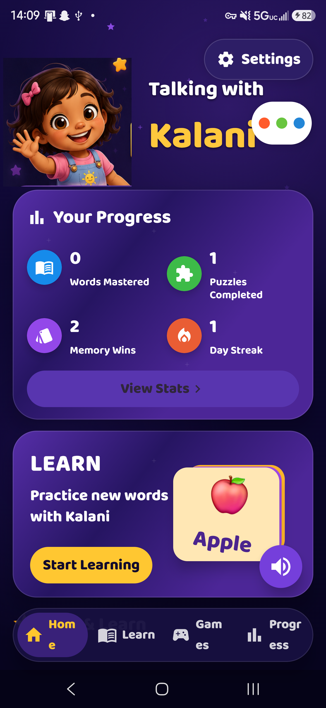
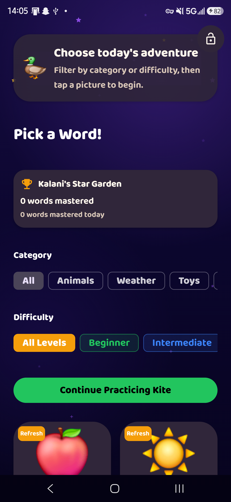
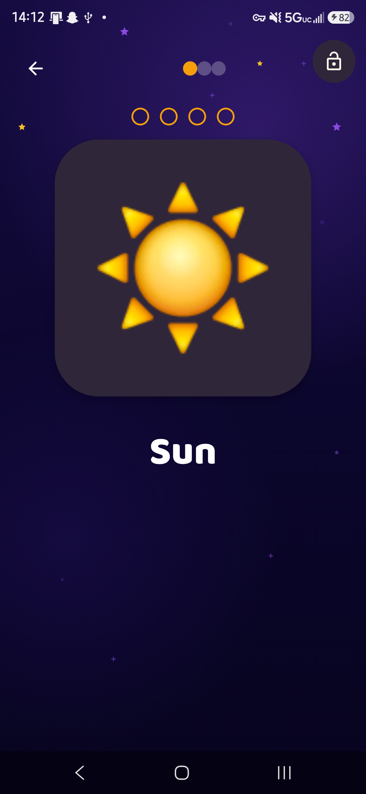
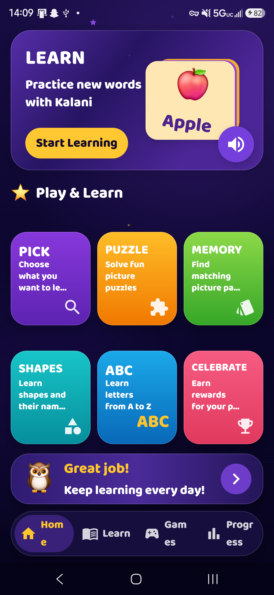
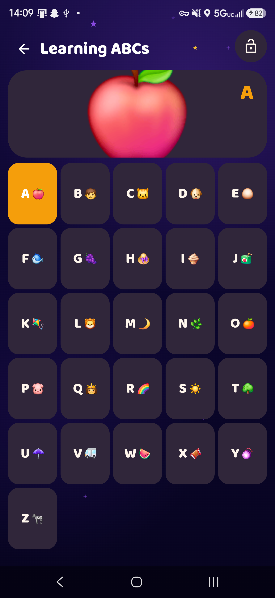
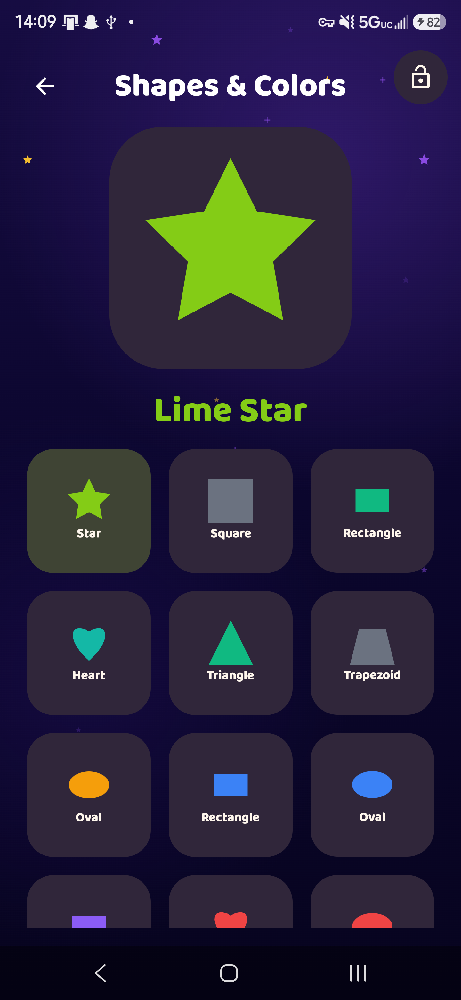
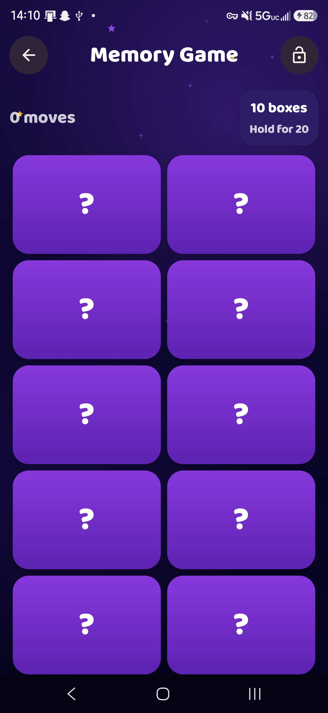
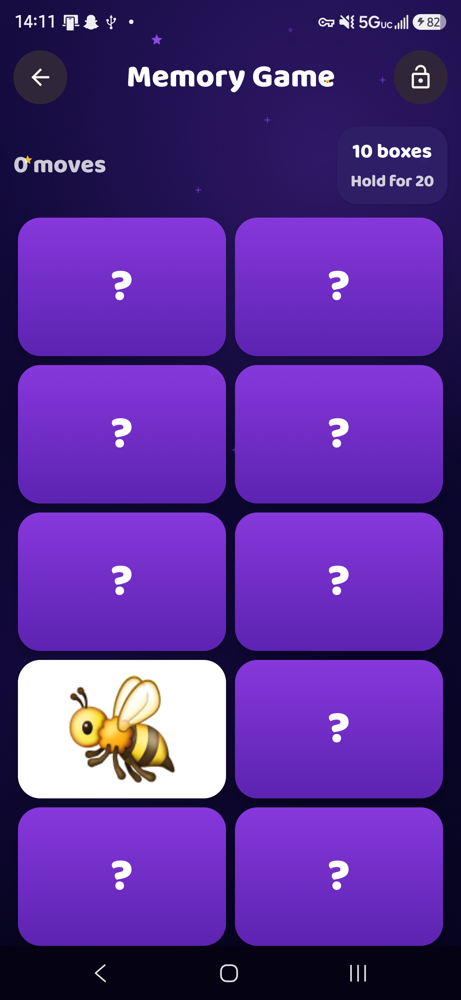
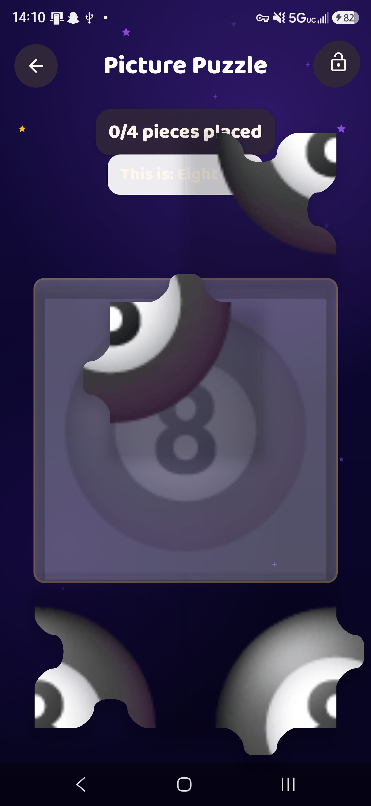

# Kalani's Word World

**An Android educational app for toddlers — vocabulary, alphabet, shapes, puzzles, and memory games — built entirely in Kotlin and Jetpack Compose.**

<p align="center">
  
</p>

> Built for my friends daughter Kalani. Every word is spoken by a real human voice. No TTS robots.

---

## What It Is

Kalani's Word World is a native Android app that teaches young children vocabulary through five interactive activities. The child taps a word card, hears it spoken in a warm, consistent human voice, and is encouraged to repeat it. Activities include flashcard vocabulary sessions, A–Z alphabet challenges, shape and color recognition, a sliding picture puzzle, and a card-flip memory game.

---

## Screens

<table>
  <tr>
    <td align="center"><br/><sub>Home dashboard</sub></td>
    <td align="center"><br/><sub>Word picker</sub></td>
    <td align="center"><br/><sub>Vocabulary flashcard</sub></td>
  </tr>
  <tr>
    <td align="center"><br/><sub>Play &amp; Learn grid</sub></td>
    <td align="center"><br/><sub>Alphabet challenge</sub></td>
    <td align="center"><br/><sub>Shapes &amp; Colors</sub></td>
  </tr>
  <tr>
    <td align="center"><br/><sub>Memory game</sub></td>
    <td align="center"><br/><sub>Card revealed</sub></td>
    <td align="center"><br/><sub>Picture puzzle</sub></td>
  </tr>
</table>

---

## Key Technical Decisions

### Zero-Latency Voice Playback

Standard TTS engines produce robot voices with 100–300ms warmup delay — a real problem for a toddler app where every tap should feel instant and warm.

**Solution:** A custom `ProxySpeechEngine` maps every spoken phrase to a pre-recorded MP3 via SHA-256 hash lookup:

```
Input text → normalize → SHA-256 → first 16 hex chars → voice_clips/{hash}.mp3
```

All ~800 audio files are bundled with the app. Playback is sub-50ms. The voice is a real person. Hash keys are locked to their text templates — if a phrase changes, CI detects the mismatch before a clip silently fails at runtime.

### Single-Activity Compose Architecture

No fragments. No fragment backstack. Navigation is a sealed `AppAction` class dispatched to a single `KalaniViewModel`. Composables observe `StateFlow` and recompose — the ViewModel is the only source of truth for every screen and game state.

### Puzzle Piece Generation

The picture puzzle generates a bitmap from the app's own word illustrations at runtime using `createPuzzleBitmap()`. Piece edges include tab/hole overlap geometry to eliminate visible seams. Pieces are scrambled via randomized non-matching spawn assignment so no piece starts in its correct slot.

### Custom Design System

No Material3 defaults. A token system (`KalaniColors`, `KalaniSpacing`) is provided via Compose `CompositionLocal` so every screen shares the same spacing, color, and typography contracts. The home screen uses a dark cosmic aesthetic intentionally distinct from the lighter activity screens — different emotional register for "launcher" vs "game".

---

## Architecture

```
MainActivity
└── KalaniViewModel          (single source of truth)
    ├── NavigationState       (current screen + history)
    ├── LearningSession       (active word loop + progress)
    ├── AppAction             (sealed class interaction contract)
    └── HybridSpeechEngine
        └── ProxySpeechEngine (SHA-256 hash lookup → MediaPlayer)
```

---

## Project Structure

```
app/src/main/java/com/example/talkingwithkalani/
├── MainActivity.kt          # Single-activity entry point
├── KalaniViewModel.kt       # All game state + AppAction dispatch
├── AppModels.kt             # Data models, sealed classes
├── Screens.kt               # Compose UI for all game screens
├── MemoryScreen.kt          # Card-flip memory game
├── ReferenceHome.kt         # Home dashboard (dark cosmic UI)
├── SpeechEngine.kt          # SHA-256 voice clip lookup + playback
├── Illustrations.kt         # Word bank + puzzle bitmap generation
├── ShapesData.kt            # 13-shape catalog + color pairings
├── AbcData.kt               # A–Z word associations
├── SettingsStore.kt         # DataStore preferences
└── ui/theme/
    ├── Color.kt             # KalaniColors light + dark tokens
    ├── Type.kt              # Baloo 2 font family (4 weights)
    ├── Theme.kt             # TalkingWithKalaniTheme entry point
    └── Spacing.kt           # KalaniSpacing token system
```

---

## Tech Stack

| Layer | Choice |
|---|---|
| Language | Kotlin |
| UI | Jetpack Compose + Material 3 |
| Architecture | Single-Activity MVVM |
| State | ViewModel + StateFlow |
| Persistence | DataStore Preferences |
| Audio | MediaPlayer with custom SHA-256 routing |
| Font | Baloo 2 (bundled, 4 static weights) |
| Min SDK | 24 (Android 7.0) |
| Target SDK | 35 (Android 15) |

---

## Activities

| Activity | What the child does |
|---|---|
| **Vocabulary** | Tap a word card → hear it spoken → repeat |
| **Alphabet Challenge** | Browse A–Z, each letter shows its word and illustration |
| **Shapes & Colors** | Tap any shape to hear its name and color |
| **Picture Puzzle** | Drag scrambled puzzle pieces into position |
| **Memory Game** | Flip cards to find matching word illustrations |

---

## Progress & Rewards

- Per-word mastery tracking with `WordProgressStore`
- Category and difficulty filters (Beginner → Intermediate → Advanced)
- Stats dashboard on home screen: words mastered, memory wins, puzzles solved, day streak
- Encouragement phrases that adapt to session performance

---

*Built with Kotlin + Jetpack Compose. Private source — this repo is a case study.*
